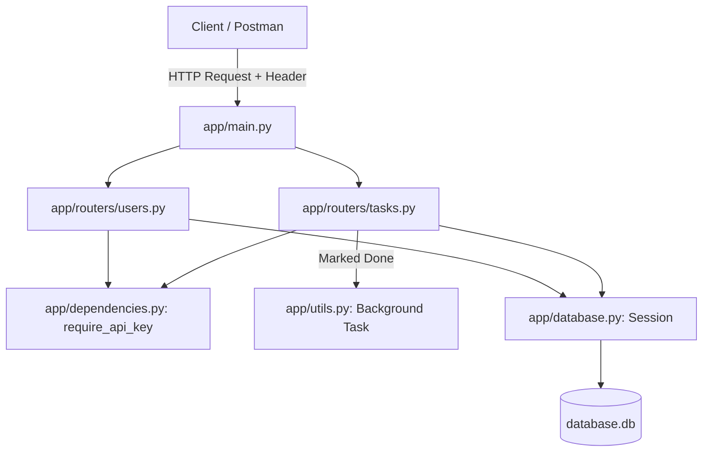
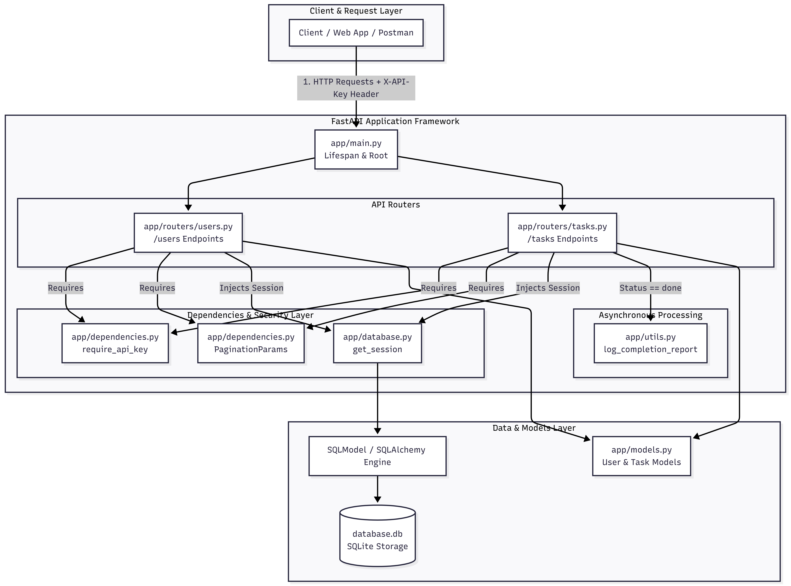

## System Architecture

```mermaid
graph TD
    Client[Client / Postman] -->|HTTP Request + Header| Main[app/main.py]
    Main --> UsersRouter[app/routers/users.py]
    Main --> TasksRouter[app/routers/tasks.py]
    
    UsersRouter --> Auth[app/dependencies.py: require_api_key]
    TasksRouter --> Auth
    
    TasksRouter -->|Marked Done| BG[app/utils.py: Background Task]
    
    UsersRouter --> DB[app/database.py: Session]
    TasksRouter --> DB
    DB --> SQLite[(database.db)]
```
